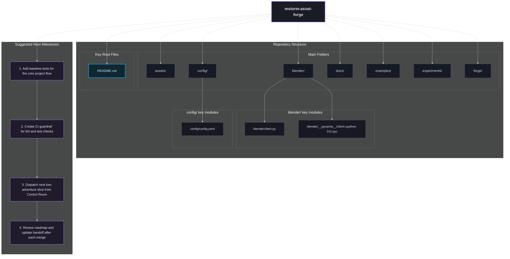

# ROADMAP

Generated: 2026-04-20T04:25:36Z
Scan Settings: depth=4, max_dirs=7, max_files_per_dir=2, max_total_modules=14

## Repo Structure Summary
- Top folders: assets, blender, config, docs, examples, experiments, forge
- Highlighted key modules: 3
- Key root files: README.md

## Actionable Module Highlights
- blender/: blender/client.py; blender/__pycache__/client.cpython-312.pyc
- config/: config/config.yaml

## Suggested Milestones
1. Add baseline tests for the core project flow
2. Create CI guardrail for lint and test checks
3. Dispatch next low-adventure slice from Control Room
4. Review roadmap and update handoff after each merge

## Lifecycle State Snapshot
- Active proposal queue:
  - `P-001` -> `HARMONIZATION_PENDING`
- Deterministic baseline:
  - `python3 main_forge.py --list` passes locally.
- Open implementation gap:
  - No repository `tests/` directory yet.

## Mermaid

## Roadmap Node Actions
- D1 | folder | assets
- D2 | folder | blender
- D3 | folder | config
- D4 | folder | docs
- D5 | folder | examples
- D6 | folder | experiments
- D7 | folder | forge
- M1 | milestone | Add baseline tests for the core project flow
- M2 | milestone | Create CI guardrail for lint and test checks
- M3 | milestone | Dispatch next low-adventure slice from Control Room
- M4 | milestone | Review roadmap and update handoff after each merge
